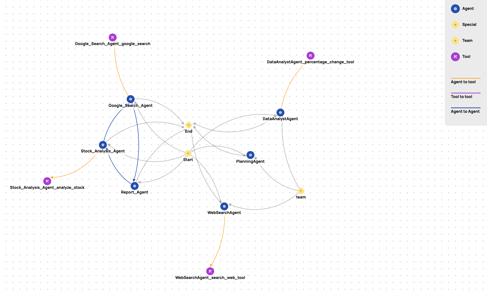

# ShadowAgent

[](https://pypi.org/project/agent-shadow/)
[](./LICENSE)
[](https://pypi.org/project/agent-shadow/)
[](https://github.com/Repello-AI/ShadowAgent/actions)
[](code_of_conduct.md)

Python CLI for **extracting agentic workflows** from popular AI frameworks and performing **automated security analysis** using threat modeling methodologies.



Designed for **developers, researchers, and security teams**, ShadowAgent enables the introspection of LLM-based orchestration logic to **visualize flows**, **map tool/agent interactions**, and **generate security reports** via structured threat modeling frameworks.

## ❓ Why Should You Use It?

In modern LLM-powered systems, agentic workflows are becoming increasingly complex — with dozens of autonomous agents, tools, and inter-agent communication chains. **ShadowAgent** helps you bring visibility, structure, and security to these otherwise opaque systems.

### Key Benefits

- **Understand Complex Agent Graphs**  
  Automatically extract and visualize agent-tool-call flows from your existing code — no manual tracing needed.

- **Integrated Security Analysis**  
  Get instant threat modeling reports tailored to your actual orchestration logic. Perfect for audits, red-teaming, or compliance reviews.

- **Developer & Researcher Friendly**  
  Simple CLI, extensible SDK, and clean JSON export — ideal for visualization, automation, or integrating with CI/CD pipelines.

- **Framework Agnostic**  
  Works with all major LLM orchestration stacks like Autogen, LangGraph, CrewAI, LlamaIndex, Swarm, and more.

- **Built for Scale & Insight**  
  ShadowAgent grows with your AI system. Whether you're prototyping or in production — it gives you introspection, fast.

## Supported Frameworks

The following orchestration frameworks are currently supported:

| Framework         | Status  |
|------------------|---------|
| Autogen (core)    | ✅      |
| AgentChat         | ✅      |
| CrewAI            | ✅      |
| LangGraph         | ✅      |
| LlamaIndex        | ✅      |
| n8n               | ✅      |
| OpenAI Agents     | ✅      |
| Pydantic-AI       | ✅      |
| Swarm             | ✅      |

Each framework has its own AST-based static parser to extract:
- Agents (class/function-based)
- Tool functions
- Agent-to-agent transitions
- Tool call chains
- Group agents (e.g., selector, round-robin)


## Security Analysis

ShadowAgent currently supports [**MAESTRO**](https://cloudsecurityalliance.org/blog/2025/02/06/agentic-ai-threat-modeling-framework-maestro) as its primary threat modeling framework. It evaluates agent workflows against the following structure:

- **M**ission
- **A**ssets
- **E**ntrypoints
- **S**ecurity Controls
- **T**hreats
- **R**isks
- **O**perations

Using LLM-backed analysis (GPT-4), a full security report is generated based on your workflow JSON.

🧪 More threat models analysis (STRIDE, PASTA, LINDDUN, etc.) are under development.


## Installation

```bash
pip install agent-shadow
```


## 🚀 CLI Usage

### 1. Extract Agentic Workflow

```bash
agent-shadow --framework autogen --directory ./examples/autogen --output autogen_graph.json
```

This will generate a graph JSON with the following structure:

```json
{
  "nodes": [...],
  "edges": [...],
  "metadata": {
    "framework": "autogen"
  }
}
```

### 2. Analyze against Threat Modeling

```bash
agent-shadow --analyze --input autogen_graph.json
```

This will generate a report like:  `autogen_report.md`  based on the provided graph and threat modeling frameworks.


__Run agentic-radar --help for more info:__
```bash
usage: agent-shadow [-h] {extract,analyze,visualize} ...

Agentic Shadow CLI: Extract, Analyze, Visualize agentic workflows.

positional arguments:
  {extract,analyze,visualize}
    extract             Extract graph from source code
    analyze             Run threat modeling analysis on extracted graph
    visualize           Generate HTML visualization from graph JSON

options:
  -h, --help            show this help message and exit
```

## 📈 Roadmap
Planned features (Not in any paricular order)
- [x] Build parsers for major agentic frameworks (Autogen, LangGraph, CrewAI, etc.)
- [x] Generate standardized JSON graph representations of agent flows
- [x] CLI interfaces
- [x] Security report generation
- [ ] Extend to STRIDE, PASTA, LINDDUN, etc.
- [ ] Agent simulation-based threat exploration

## 🤝 Contributing

We welcome contributions of all kinds!

⚠️ Please read [`CONTRIBUTING.md`](./CONTRIBUTING.md) before submitting issues or PRs.


## 📜 Changelog

For recent changes and version history, see [`CHANGELOG.md`](./CHANGELOG.md).

## 📄 License

Licensed under the **Apache 2.0 License**. See [`LICENSE`](./LICENSE) for full details.

## Links

- [ShadowAgent GitHub](https://github.com/Repello-AI/ShadowAgent)
- [Issue Tracker](https://github.com/Repello-AI/ShadowAgent/issues)
- [PyPI Package](https://pypi.org/project/agent-shadow/)
